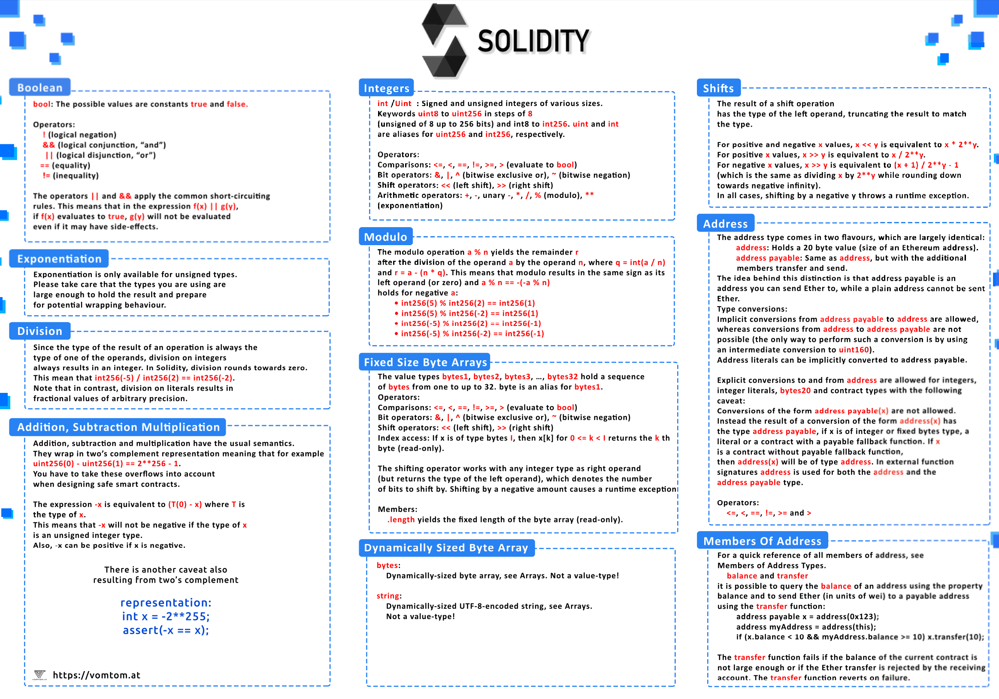
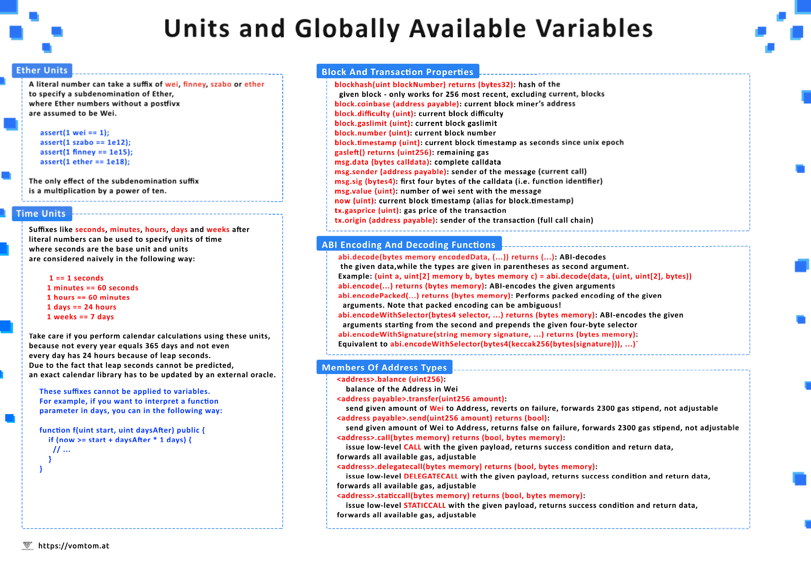

# evm-dev-bootcamp

This repository contains a collection of projects and exercises completed as part of the [Ethereum Blockchain Developers](https://www.udemy.com/course/blockchain-developer/) course on Udemy. The course was conducted by Ravinder Deol, Thomas Wiesner, and Haseeb Chaudhry and was completed in 2021. It serves as a comprehensive guide for developing various smart contracts and decentralized applications (dApps) on the Ethereum blockchain.

## Repository Contents

- [Contract Fundamentals](/contract-fundamentals/): This directory contains various Solidity contracts demonstrating best practices for writing secure and efficient smart contracts on the Ethereum blockchain.
- [Geth Modification](/geth-modification/): Resources related to setting up private blockchain networks using the Go Ethereum (Geth) client.
- [Shared Wallet](/shared-wallet/): Shared wallet project, a decentralized application that enables multiple parties to share funds in a secure manner.
- [Supply Chain](/supply-chain/): Supply chain decentralized application. The dApp demonstrates how blockchain can revolutionize supply chain management by ensuring transparency and traceability.
- [Token Sale](/token-sale/): Token Sale Application that demonstrates the concept of coin offerings, KYC, and whitelists.

#### [Web3 Instance](/web3-instance/)

This directory consists of scripts showing how to interact with the Ethereum blockchain using the Web3.js instance that can be used within webpages and servers.

#### [Web3 Terminal](/web3-terminal/)

This directory contains scripts designed to run in the terminal for interacting with Ethereum blockchain. The scripts demonstrate how to carry out common operations such as querying balances, sending transactions, and interacting with smart contracts.

> Note: The dApps in the 'Supply Chain' and 'Tokenization' directories feature setups using the **Truffle** framework and the **Ganache** personal blockchain for testing and deployment purposes.

## Cheat Sheets

## Tools

- [Web3.js](https://web3js.readthedocs.io/en/v1.7.4/)
- [Truffle](https://trufflesuite.com/)
- [Ganache](https://trufflesuite.com/ganache/)

## Further Codebases

- [go-ethereum](https://github.com/ethereum/go-ethereum)
- [openzeppelin-contracts](https://github.com/OpenZeppelin/openzeppelin-contracts)
